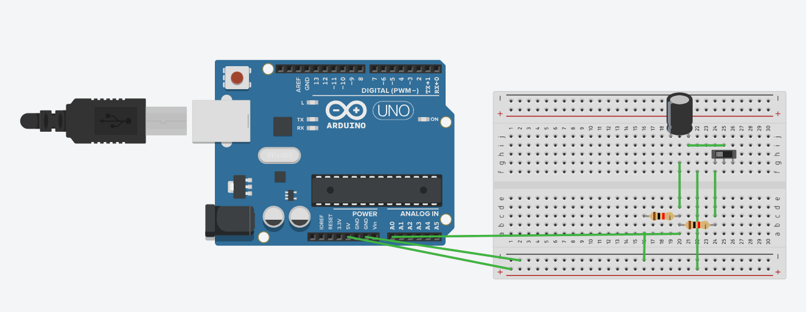
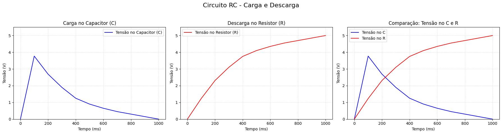

🧩 Circuito RC — Carga e Descarga

🎯 Objetivo

O objetivo deste experimento foi observar o comportamento da carga e descarga de um capacitor em um circuito RC (Resistor + Capacitor), analisando a variação de tensão ao longo do tempo tanto no resistor (R) quanto no capacitor (C).

⚙️ Montagem do Circuito

O circuito foi montado no Tinkercad, utilizando os seguintes componentes:

1x Resistor de 1 MΩ (Re)

1x Resistor de 100 Ω (Rd)

1x Capacitor de 10 μF / 25V

1x Chave (para alternar entre carga e descarga)

1x Arduino UNO

Fios de conexão

📸 Imagem da montagem:

🔗 [Acesse o projeto no Tinkercad](https://www.tinkercad.com/things/lc3LA5GrMZl-surprising-albar-jaiks?sharecode=TADhydGFIj1I2tU6C3eqgT7OiIbgkYqbbMBleru652Y)

💻 Coleta de Dados

O código do Arduino foi configurado para enviar ao Monitor Serial os valores de tensão lidos durante o processo de carga e descarga do capacitor.
Esses dados foram copiados do Monitor Serial e importados para o Python, que foi utilizado para gerar os gráficos.

📊 Geração dos Gráficos no Python

Após copiar os dados do Monitor Serial, foi criado um script em Python (utilizando matplotlib) para visualizar os resultados.
Os gráficos mostram claramente o comportamento do circuito RC:

Carga do Capacitor (C): tensão aumenta até atingir o valor máximo (~5V).

Descarga no Resistor (R): tensão decresce gradualmente até 0V.

Comparação: mostra a relação inversa entre as tensões do capacitor e do resistor.

📈 Gráficos gerados:

🧠 Conclusão

O experimento demonstrou na prática o comportamento exponencial do circuito RC:

Durante a carga, o capacitor armazena energia e sua tensão cresce gradualmente até o valor da fonte.

Durante a descarga, o capacitor libera essa energia através do resistor, reduzindo a tensão até 0V.

O resistor controla a velocidade desse processo, e a curva obtida confirma a teoria da constante de tempo (τ = R × C).

📚 Tecnologias Utilizadas

🔹 Tinkercad — simulação do circuito e coleta dos dados

🔹 Arduino UNO — leitura dos valores de tensão

🔹 Python + Google colab — análise e geração dos gráficos
